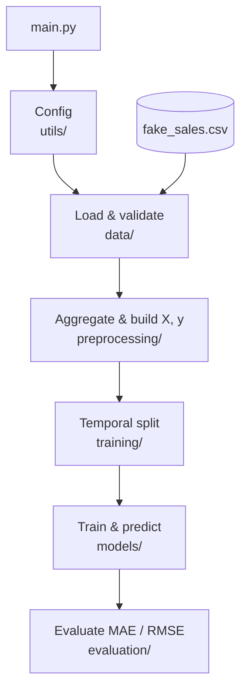

# M5 Monthly SKU Forecast

Projeto de previsão de demanda desenvolvido para a disciplina de Engenharia de Software da Especialização em Deep Learning (UFPE).

## Problema

Prever a **demanda mensal por SKU** (produto) a partir de histórico de vendas. O dataset de referência é o [M5 Forecasting](https://www.kaggle.com/competitions/m5-forecasting-accuracy) (Walmart), em que cada SKU corresponde ao `item_id` agregado em todas as lojas.

## Abordagem

1. Carregar vendas brutas (diárias) e agregar por mês e por SKU.
2. Transformar cada série temporal em um dataset tabular `(X, y)`:
   - **X**: lags históricos (1, 2, 3, 6 e 12 meses);
   - **y**: demanda do próximo mês (`horizon = 1`).
3. Dividir os dados com **split temporal** (treino, validação e teste).
4. Treinar um modelo de regressão linear com **NumPy** (baseline).
5. Evoluir para uma **MLP com PyTorch**, reutilizando o mesmo formato tabular.

## Estrutura do projeto

```text
forecasting-project/
├── src/
│   ├── main.py
│   ├── data/
│   │   └── loader.py
│   ├── preprocessing/
│   │   └── transform.py
│   ├── models/
│   │   └── linear.py
│   ├── training/
│   │   └── split.py
│   ├── evaluation/
│   │   └── metrics.py
│   └── utils/
│       └── config.py
├── data/
│   └── sample/
│       └── fake_sales.csv
├── README.md
└── requirements.txt
```

## Pipeline

O `src/main.py` orquestra o fluxo abaixo. Nesta etapa, cada função imprime a etapa correspondente e ainda não implementa a lógica (`pass`).



| Etapa | Módulo | Entrada | Saída |
|-------|--------|---------|-------|
| Configuração | `utils/config` | — | `ProjectConfig` |
| Carga | `data/loader` | CSV diário | `DataFrame` bruto |
| Validação | `data/loader` | dados brutos | schema validado |
| Agregação | `preprocessing/transform` | vendas diárias | série mensal por SKU |
| Features | `preprocessing/transform` | série mensal | `(X, y)` tabular com lags |
| Split | `training/split` | dataset supervisionado | treino / validação / teste |
| Modelo | `models/linear` | arrays NumPy | previsões |
| Avaliação (validação) | `evaluation/metrics` | `y_true`, `y_pred` (val) | MAE, RMSE |
| Avaliação (teste) | `evaluation/metrics` | `y_true`, `y_pred` (test) | MAE, RMSE |

## Como executar

### Com uv (recomendado)

```bash
uv run python -m src.main
```

### Com pip

```bash
python -m venv .venv
source .venv/bin/activate   # Windows: .venv\Scripts\activate
pip install -r requirements.txt
python -m src.main
```

Nesta etapa, as funções contêm assinaturas com type hints, `pass` e prints indicando cada etapa do pipeline; a implementação virá nas próximas fases.

## Decisões de design

| Tópico | Decisão |
|--------|---------|
| SKU | `item_id` agregado em todas as `store_id` |
| Granularidade | mensal |
| Features iniciais | lags 1, 2, 3, 6 e 12 |
| Horizonte | 1 mês à frente |
| Split | temporal (não aleatório) |
| Modelo inicial | regressão linear (NumPy) |

## Dados

- **Produção / entrega final:** M5 Forecasting (não versionado neste repositório).
- **Desenvolvimento:** `data/sample/fake_sales.csv` (3 SKUs, 2 lojas, jan/2014–dez/2015).

## Roadmap

- [x] Estrutura modular e funções com type hints (stubs)
- [x] Dataset fake de desenvolvimento
- [ ] Implementação do pipeline de dados e features
- [ ] Split temporal e regressão linear
- [ ] Integração com M5
- [ ] Modelo MLP com PyTorch
